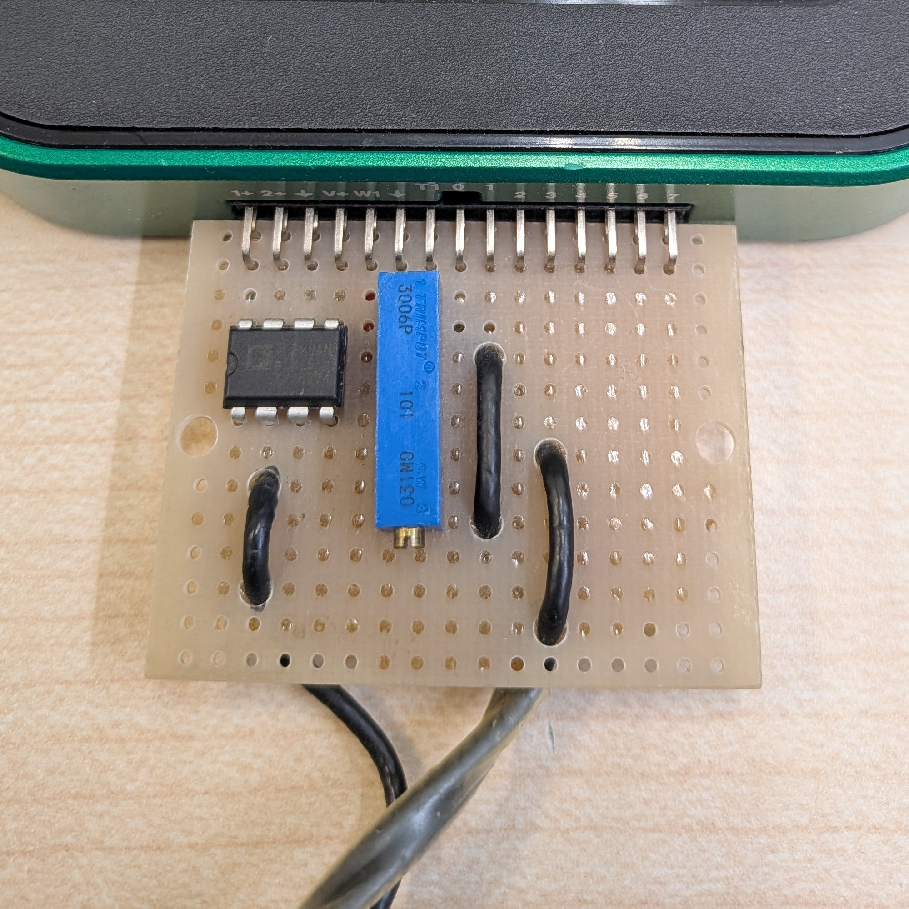

# Software Lock-in Amplifier using Digilent Analog Discovery
  
## What is this?
  - This software facilitates the construction of a software Lock-In Amplifier (LIA) within the Windows using the Digilent Analog Discovery 2 or 3 (AD).
  - The LIA, such as [NF LI5660](https://www.nfcorp.co.jp/english/pro/mi/loc/loc/index.html) or [Stanford Research Systems SR844](https://thinksrs.com/products/sr844.html), is an instrument that has the capacity to measure the amplitude and phase of sinusoidal wave voltages.
  - The LIAs utilize a technique known as phase-sensitive detection (PSD) or synchronous detection, as illustrated in the accompanying figure and [Youtube (In Japanese)](https://www.youtube.com/watch?v=pHyuB1YW4qY).
  
    $A=\sqrt{x^2+y^2}$, $\theta=\arctan{\frac{y}{x}}$
    ```
    void psd::calc(double* pX, double* pY) {
        *pX = 0;
        *pY = 0;
        // Multiplier
        for (int i = 0; i < this->size; i++) {
            *pX += this->rawData[i] * this->sine[i];
            *pY += this->rawData[i] * this->cosine[i];
        }
        // Low pass filter
        *pX /= this->size;
        *pY /= this->size;
    }
    ```
## Usage
  - The establishment of a connection between "W1" and "1+" and between "1-" and "Ground" of the AD will result in the visualization of the real component X and imaginary component Y of the sinusoidal waveform output from "W1" on the "XY" window.
  - The frequency and amplitude of the waveform output from "W1" can be controlled through the "Freq." and "Volt." parameters on the "Control Panel."
  - The waveform entered in "1+" will be displayed on the "Raw waveform" window.
  - The following figure shows a circuit as a practical application of LIA for the Eddy Current Testing (ECT).
  
  
  

  | Parts | Type |  |
  | ---- | ---- | ---- |
  | DAQ | Digilent Analog Discovery 3 | [Analog Discovery 3: 125 MS/s USB Oscilloscope, Waveform Generator, Logic Analyzer, and Variable Power Supply](https://digilent.com/reference/test-and-measurement/analog-discovery-3/start) |
  | L-shaped Pin Socket | 2×15 | https://akizukidenshi.com/catalog/g/g113419/ |
  | Prototyping board |  47×36mm  | https://akizukidenshi.com/catalog/g/g111960/ |
  | Instrument amplifier | Analog Devices AD620ANZ | https://akizukidenshi.com/catalog/g/g113693/ |
  | Register for gain 40dB | 510Ω | [See "Gain Selection" on page 15 of the AD620 datasheet.](https://www.analog.com/media/en/technical-documentation/data-sheets/AD620.pdf) |
  | Bypass capacitor | 0.1uF×2 | https://akizukidenshi.com/catalog/g/g110149/ |
  | Variable register | 100Ω | https://akizukidenshi.com/catalog/g/g117821/ |
  | $L_1$, Sensor coil| Approximately 50Ω at the operating frequency | https://akizukidenshi.com/catalog/g/g116967/ |
  | $L_2$, Reference coil | Same as above | https://akizukidenshi.com/catalog/g/g116967/ |
  | Coaxial cable | Characteristic impedance 50Ω | https://akizukidenshi.com/catalog/g/g116943/|
  
  - The AD620 and INA128/129 are known as effective instrument amplifiers.
  - The provision of power for the amplifier and sensors, such as coils, can be facilitated by the AD.
  - However, it is imperative to exercise caution with regard to the power supply limitations inherent to the AD. For instance, the maximum voltage from AD is ±5V, and the current is constrained by the capabilities of the USB connection or any additional AC adapters connected.
  - Due to input voltage range of the AD is ±25V, which allows for the possibility of supplying higher voltages through external power sources. It is imperative to exercise caution and avoid the application of excessive voltage or current to the AD to avert potential damage.
  - For information about ECT, please refer to the following YouTube video (in Japanese):

    [](https://www.youtube.com/watch?v=P5mSKKPTCwQ)
## Used software
  - [Digilent Waveforms SDK](https://digilent.com/reference/software/waveforms/waveforms-sdk/reference-manual)
  - [GLFW](https://www.glfw.org/)
  - [Dear ImGui](https://github.com/ocornut/imgui) & [ImPlot](https://github.com/epezent/implot)
  - [inifile-cpp](https://github.com/Rookfighter/inifile-cpp)
## Acknowledgments
  This software was developed with the Analog Discovery, a high-performance hardware platform, user-friendly yet powerful software such as the ImPlot, and Github. The author would like to express their gratitude to Digilent, NI, and the OSS communities, and remain hopeful that NI, a titan in the measurement industry, will continue to make AD products available for purchase.
