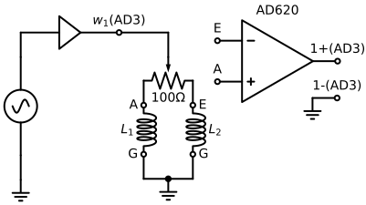

# Software Lock-in Amplifier using Digilent Analog Discovery
  
## What is this?
  - This software is a lightweight, Windows-based software lock-in amplifier (LIA) built around the Digilent Analog Discovery 2 or 3 (AD).
  - The LIA, such as [NF LI5660](https://www.nfcorp.co.jp/english/pro/mi/loc/loc/index.html) or [Stanford Research Systems SR844](https://thinksrs.com/products/sr844.html), is an instrument that measures the amplitude and phase of sinusoidal signals using a technique known as Phase-Sensitive Detection (PSD) or synchronous detection.
  - This technique is shown in the following diagram and is also explained on [Youtube (in Japanese)](https://www.youtube.com/watch?v=pHyuB1YW4qY).
  
    Amplitude: $A=\sqrt{x^2+y^2}$, Phase: $\theta=\arctan{\frac{y}{x}}$
  - Core PSD Calculation (C++)
    ```
    void psd::calc(double* pX, double* pY) {
        *pX = 0;
        *pY = 0;
        // Multiplier
        for (int i = 0; i < this->size; i++) {
            *pX += this->rawData[i] * this->sine[i];
            *pY += this->rawData[i] * this->cosine[i];
        }
        // Low pass filter
        *pX /= this->size;
        *pY /= this->size;
    }
    ```
## Quick Start
  1. Connect Analog Discovery:
      - Waveform generator "W1" → Oscilloscope channel "1+"
      - Ground → Oscilloscope ground "1-"
  1. Launch "lia.exe" and adjust frequency and amplitude from the control panel on "lia.exe".
  1. Reading Outputs
      - Raw Waveform: Displayed in the “Raw waveform” window.
      - X/Y Components: Shown in the “XY” window in real time.
## Practical demonstration for eddy current testing (ECT)
  - The following figure shows a circuit as a practical application of LIA for the ECT.
  
  
  

  | Parts | Type |  |
  | ---- | ---- | ---- |
  | DAQ | Digilent Analog Discovery 3 | [Analog Discovery 3: 125 MS/s USB Oscilloscope, Waveform Generator, Logic Analyzer, and Variable Power Supply](https://digilent.com/reference/test-and-measurement/analog-discovery-3/start) |
  | L-shaped Pin Socket | 2×15 | https://akizukidenshi.com/catalog/g/g113419/ |
  | Prototyping board |  47×36mm  | https://akizukidenshi.com/catalog/g/g111960/ |
  | Instrument amplifier | Analog Devices AD620ANZ | https://akizukidenshi.com/catalog/g/g113693/ |
  | Register for gain 40dB | 510Ω | [See "Gain Selection" on page 15 of the AD620 datasheet.](https://www.analog.com/media/en/technical-documentation/data-sheets/AD620.pdf) |
  | Bypass capacitor | 0.1uF×2 | https://akizukidenshi.com/catalog/g/g110149/ |
  | Variable register | 100Ω | https://akizukidenshi.com/catalog/g/g117821/ |
  | $L_1$, Sensor coil| Approximately 50Ω at the operating frequency | https://akizukidenshi.com/catalog/g/g116967/ |
  | $L_2$, Reference coil | Same as above | https://akizukidenshi.com/catalog/g/g116967/ |
  | Coaxial cable | Characteristic impedance 50Ω | https://akizukidenshi.com/catalog/g/g116943/|
  
  - The AD620 and INA128/129 are known as effective instrument amplifiers.
  - The provision of power for the amplifier and sensors, such as coils, can be facilitated by the AD.
  - However, it is imperative to exercise caution with regard to the power supply limitations inherent to the AD. For instance, the maximum voltage from AD is ±5V, and the current is constrained by the capabilities of the USB connection or any additional AC adapters connected.
  - Due to input voltage range of the AD is ±25V, which allows for the possibility of supplying higher voltages through external power sources. It is imperative to exercise caution and avoid the application of excessive voltage or current to the AD to avert potential damage.
  - For information about ECT, please refer to the following YouTube video (in Japanese):

    [](https://www.youtube.com/watch?v=P5mSKKPTCwQ)
## Python
  - Control the LIA and collect data directly from Python:
  ```
  import subprocess
  import numpy as np
  import matplotlib.pyplot as plt
  import time


  class Lia:
    def __init__(self, path='./lia.exe'):
      self.process = subprocess.Popen(
          f'{path} pipe',
            stdin=subprocess.PIPE,
            stdout=subprocess.PIPE,
            encoding='utf-8',
      )
      print(self._recieve())
    def __del__(self):
      self.process.kill()
    def _send(self, cmd:str):
      self.process.stdin.write(f'{cmd}\n')
      self.process.stdin.flush()
    def _recieve(self, ):
      self.process.stdout.flush()
      return self.process.stdout.readline()
    def _query(self, cmd):
      self._send(cmd)
      return self._recieve()
    def get_txy(self):
      buf = self._query('get_txy').split(",")
      return (float(buf[0]), float(buf[1]), float(buf[2]))
    def get_fgFreq(self):
      return float(self._query('get_fgFreq'))
    def set_fgFreq(self, freq):
      self._send(f'set_fgFreq {freq}\n')


  def getDat(lia:Lia):
    dat = []
    for i in range(5000):
      dat.append(lia.get_txy())
      time.sleep(0.002)
    return np.array(dat)

  def makeChart(dat:np.array):
    fig, ax = plt.subplots(1, 2, figsize=(3*2,3))
    ax[0].plot(dat[:,0], dat[:,1], label='$V_x$')
    ax[0].plot(dat[:,0], dat[:,2], label='$V_y$')
    ax[1].plot(dat[:,1], dat[:,2])
    ax[0].set_xlabel('Time (s)')
    ax[0].set_ylabel('$V$ (V)')
    ax[0].legend()
    ax[1].set_xlabel('$V_x$ (V)')
    ax[1].set_ylabel('$V_y$ (V)')
    ax[1].set_aspect('equal', 'box')
    ax[0].grid()
    ax[1].grid()
    ax[1].set_xlim(-1.3, 1.3)
    ax[1].set_ylim(-1.3, 1.3)
    fig.tight_layout()
    fig.savefig('chart.svg')
  ```
  
## Software Dependencies
  - [Digilent Waveforms SDK](https://digilent.com/reference/software/waveforms/waveforms-sdk/reference-manual)
  - [GLFW](https://www.glfw.org/)
  - [Dear ImGui](https://github.com/ocornut/imgui) & [ImPlot](https://github.com/epezent/implot)
  - [inifile-cpp](https://github.com/Rookfighter/inifile-cpp)
## Acknowledgments
  This software was developed with the Analog Discovery, a high-performance hardware platform, user-friendly yet powerful software such as the ImPlot, and Github. The author would like to express their gratitude to Digilent, NI, and the OSS communities, and remain hopeful that NI, a titan in the measurement industry, will continue to supply the Analog Discovery.
