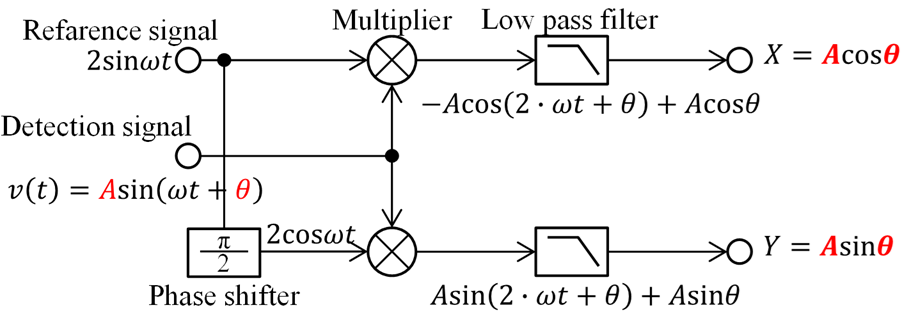

# LIA: Dual-Channel Software Lock-in Amplifier with Digilent Analog Discovery
  
## Overview 🔍
  - This software is a Windows-based software Lock-In Amplifier (LIA) designed for precision signal measurement and analysis. It interfaces seamlessly with Digilent Analog Discovery 2/3 devices, enabling real-time amplitude and phase detection up to 100 kHz. Ideal for research, education, and experimental applications in measurement engineering.
  - The LIA, such as [NF LI5660](https://www.nfcorp.co.jp/english/pro/mi/loc/loc/index.html) or [Stanford Research Systems SR844](https://thinksrs.com/products/sr844.html), is an instrument that measures the amplitude $A$ and phase $\theta$ of sinusoidal signals using a technique known as Phase-Sensitive Detection (PSD) or synchronous detection.
  - This technique is shown in the following diagram and is also explained on [Youtube (in Japanese)](https://www.youtube.com/watch?v=pHyuB1YW4qY).
  

  Amplitude: $A=\sqrt{x^2+y^2}$, Phase: $\theta=\arctan{\frac{y}{x}}$
  - The following code demonstrates the simplest implementation of a Core PSD calculation in C++.
    ```
    void psd::calc(double* pX, double* pY) {
        *pX = 0;
        *pY = 0;
        // Multiplier
        for (int i = 0; i < this->size; i++) {
            *pX += this->rawData[i] * this->sine[i];
            *pY += this->rawData[i] * this->cosine[i];
        }
        // Low pass filter
        *pX /= this->size;
        *pY /= this->size;
    }
    ```
    - However, after creating this software, the author discovered that a software, Digilent Waveforms, already includes lock-in functionality as a standard feature. For details, please refer to: [here](https://digilent.com/blog/how-to-separate-the-signal-from-the-noise/), [here](https://digilent.com/reference/test-and-measurement/guides/waveforms-oscilloscope?s[]=lockin#lock-in_amplifier), and [here](https://forum.digilent.com/topic/31231-lock-in-amplifier-phase-measurement-in-degrees-and-not-voltage/#comment-95389). How convenient!
    - The author recommends verifying the original functionality before using this software.

## Features ✨
  - 🎛️ Dual-channel lock-in detection
    - Analyze two signals simultaneously with high precision.
  - ⚡ Ideal for high-frequency applications
    - Supports up to 100 kHz reference frequency.
  - 🚀 Not slow
    - Sampling time is 2 ms.
      - AMD Ryzen 5 PRO 5650GE: 2.00±0.04 ms
      - Intel Core i5-1235U: 2.00±0.08 ms
      - Intel Core i9-13900H: 2.000±0.002 ms
  - 💾 Ring buffer recording
    - Store default 10 minutes of continuous data.
  - 📈 Real-time visualization
    - Raw waveform, XY plot, and time chart.
  - 🐍 Python integration Control
    - LIA and retrieve data via pipe communication.

## Getting Started 🛠️
  1. Install Dependencies
     - Digilent WaveForms SDK
  1. Hardware Setup
     - Connect Analog Discovery 2 or 3 to your PC
     - Example wiring:
       - W1 → CH1+
       - GND → CH1−
  1. Launch LIA
      - Run lia.exe
      - Configure frequency and amplitude via GUI
      - View results in:
        - "Raw waveform" window
        - "XY" window for X/Y component visualization
        - "Time chart" window for Y component
## Application Example 🧪: Eddy Current Testing (ECT)
  - LIA is well-suited for non-destructive testing such as ECT. By combining AD620-based amplification circuits with sensor coils, users can identify material types and detect surface defects in conductive materials.
  - The following figure shows a circuit as a practical application of LIA for the ECT.
  
  
  
  

  | Parts | Type |  |
  | ---- | ---- | ---- |
  | DAQ | Digilent Analog Discovery 3 | [Analog Discovery 3: 125 MS/s USB Oscilloscope, Waveform Generator, Logic Analyzer, and Variable Power Supply](https://digilent.com/reference/test-and-measurement/analog-discovery-3/start) |
  | L-shaped Pin Socket | 2×15 | https://akizukidenshi.com/catalog/g/g113419/ |
  | Prototyping board |  47×36mm  | https://akizukidenshi.com/catalog/g/g111960/ |
  | Instrument amplifier | Analog Devices AD620ANZ | https://akizukidenshi.com/catalog/g/g113693/ |
  | Register for gain 40dB | 510Ω | [See "Gain Selection" on page 15 of the AD620 datasheet.](https://www.analog.com/media/en/technical-documentation/data-sheets/AD620.pdf) |
  | Bypass capacitor | 0.1uF×2 | https://akizukidenshi.com/catalog/g/g110149/ |
  | Variable register | 100Ω | https://akizukidenshi.com/catalog/g/g117821/ |
  | $L_1$, Sensor coil| Approximately 50Ω at the operating frequency | https://akizukidenshi.com/catalog/g/g116967/ |
  | $L_2$, Reference coil | Same as above | https://akizukidenshi.com/catalog/g/g116967/ |
  | Coaxial cable | Characteristic impedance 50Ω | https://akizukidenshi.com/catalog/g/g116943/|
  
  - The AD620 and INA128/129 are known as effective instrument amplifiers.
  - The provision of power for the amplifier and sensors, such as coils, can be facilitated by the AD.
  - However, it is imperative to exercise caution with regard to the power supply limitations inherent to the AD. For instance, the maximum voltage from AD is ±5V, and the current is constrained by the capabilities of the USB connection or any additional AC adapters connected.
  - Due to maximum input voltage range of the AD is ±25V, the default voltage for this software is ±2.5V, which allows for the possibility of supplying higher voltages through external power sources. It is imperative to exercise caution and avoid the application of excessive voltage or current to the AD to avert potential damage.
  - For information about ECT, please refer to [an old document created by Hocking NDT](https://www.scribd.com/doc/48834808/An-Introduction-to-Eddy-Current-Theory-and-technology) or the following YouTube video (in Japanese):

    [](https://www.youtube.com/watch?v=P5mSKKPTCwQ)
## 🐍 Python Integration
  - Control LIA and retrieve data directly from Python (See also [pipe.h](./LIA/pipe.h)). Example: generate time chart and XY(Lissajous) plots.
  ```
  import subprocess
  import numpy as np
  import matplotlib.pyplot as plt
  import time


  class Lia:
    def __init__(self, path='./lia.exe'):
      self.process = subprocess.Popen(
          f'{path} pipe',
            stdin=subprocess.PIPE,
            stdout=subprocess.PIPE,
            encoding='utf-8',
      )
      print(self._recieve())
    def __del__(self):
      self.process.kill()
    def _send(self, cmd:str):
      self.process.stdin.write(f'{cmd}\n')
      self.process.stdin.flush()
    def _recieve(self, ):
      self.process.stdout.flush()
      return self.process.stdout.readline()
    def _query(self, cmd):
      self._send(cmd)
      return self._recieve()
    def get_txy(self):
      buf = self._query('get_txy').split(",")
      return (float(buf[0]), float(buf[1]), float(buf[2]))
    def get_fgFreq(self):
      return float(self._query('get_fgFreq'))
    def set_fgFreq(self, freq):
      self._send(f'set_fgFreq {freq}\n')

  def getDat(lia:Lia):
    dat = []
    for i in range(5000):
      dat.append(lia.get_txy())
      time.sleep(0.002)
    return np.array(dat)

  def makeChart(dat:np.array):
    fig, ax = plt.subplots(1, 2, figsize=(3*2,3))
    ax[0].plot(dat[:,0], dat[:,1], label='$V_x$')
    ax[0].plot(dat[:,0], dat[:,2], label='$V_y$')
    ax[1].plot(dat[:,1], dat[:,2])
    ax[0].set_xlabel('Time (s)')
    ax[0].set_ylabel('$V$ (V)')
    ax[0].legend()
    ax[1].set_xlabel('$V_x$ (V)') 
    ax[1].set_ylabel('$V_y$ (V)')
    ax[1].set_aspect('equal', 'box')
    ax[0].grid()
    ax[1].grid()
    ax[1].set_xlim(-1.3, 1.3)
    ax[1].set_ylim(-1.3, 1.3)
    fig.tight_layout()
    fig.savefig('chart.svg')

  lia = Lia('./lia.exe')
  dat = getDat(lia)
  makeChart(dat) # Save time series and XY(Lissajous) plots of X/Y components
  ```
  - The following figures show X/Y components when the coil is in contact with different materials in the ECT.
  
## System Requirements ⚙️
  - OS: Windows 10/11
  - Hardware: Digilent Analog Discovery 2 or 3
  - Development: Microsoft Visual Studio 2022 (C++20)
  - Dependencies:
    - [GLFW](https://www.glfw.org/)
    - [Dear ImGui](https://github.com/ocornut/imgui) & [ImPlot](https://github.com/epezent/implot)
    - [inifile-cpp](https://github.com/Rookfighter/inifile-cpp)
## Acknowledgments 🙏
  This software was developed with the Analog Discovery, a high-performance hardware platform, user-friendly yet powerful software such as the ImPlot, and Github. The author would like to express their gratitude to Digilent, NI, and the OSS communities, and remain hopeful that NI, a titan in the measurement industry, will continue to supply the excellent measurement instrument "Analog Discovery."
